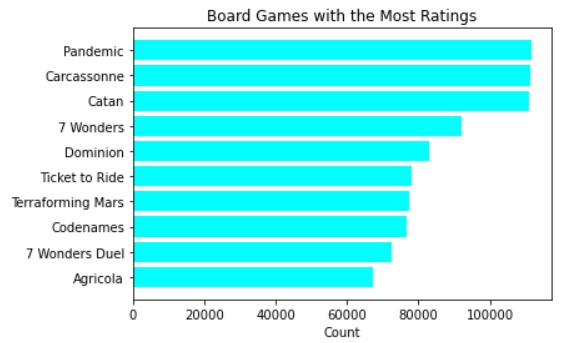
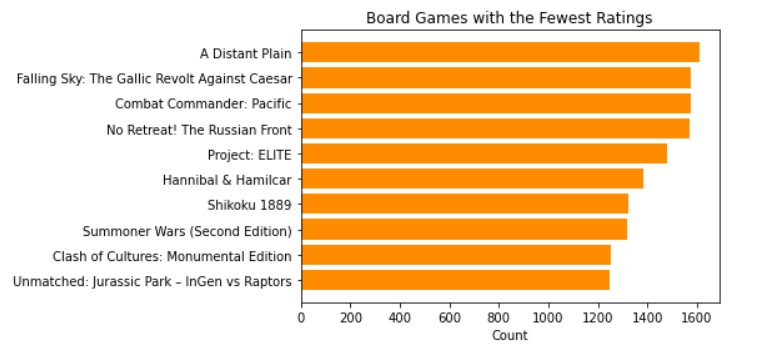
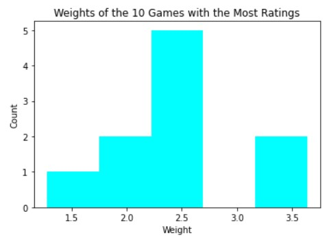
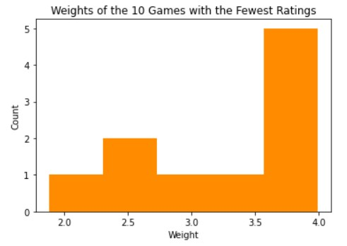
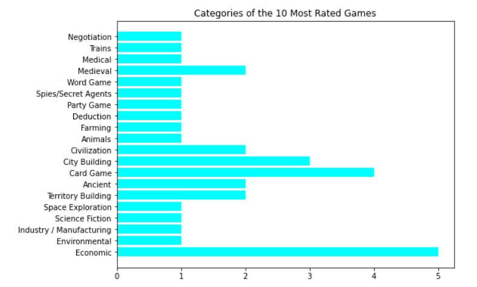
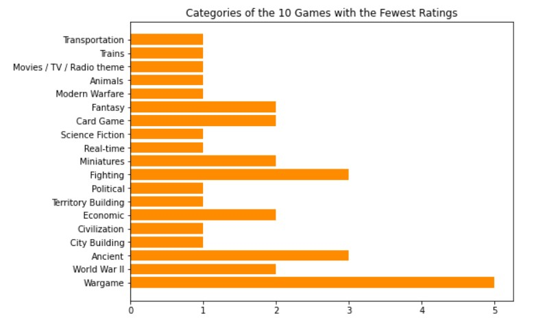
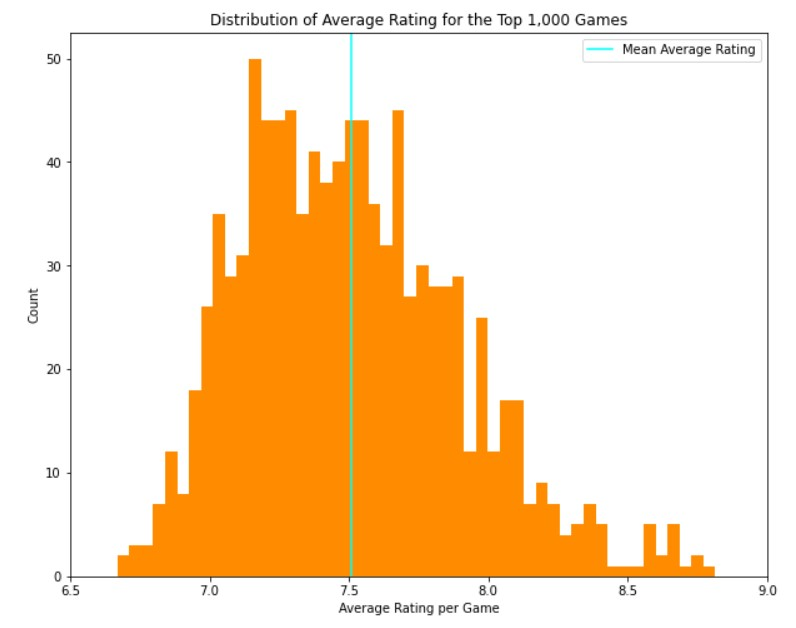
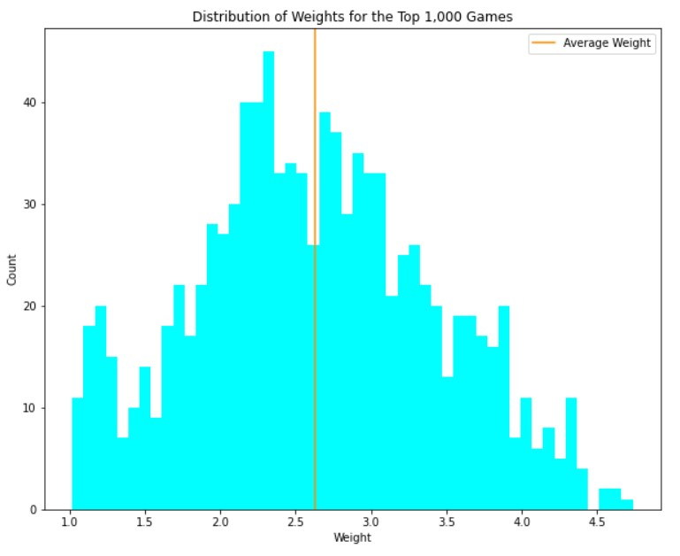

# Board Game Recommender

#### [Click here to go directly to the app.](https://share.streamlit.io/tprich/board_game_recommender/main/streamlit_app/recommender_app.py)

## Do You Like Games?

One of my favorite activities is playing board games with friends and family. From cooperative games like [Betrayal at House on the Hill](https://boardgamegeek.com/boardgame/10547/betrayal-house-hill) to everyone for themselves games like [Ticket to Ride](https://boardgamegeek.com/boardgame/9209/ticket-ride), we play them all. The problem is that after playing the same games over and over again, we want to try something new but don’t always know where to start. Do we want to choose a game based on how many people we have for the game session, or do we want to try something like what we already have played? That led me to working on this project, a board game recommender app that can give recommendations based on user reviews or by categories and features. If you like board games and want to get some ideas on what to play next, check out the app at the link above. 

## Where the Data Came From

All of the data for this project comes from [BoardGameGeek](https://boardgamegeek.com). Thank you BoardGameGeek for providing all of the data for use under the [Attribution-NonCommercial-ShareAlike 3.0 Unported license](https://creativecommons.org/licenses/by-nc-sa/3.0/). There is an API specifically for use with BoardGameGeek and it's sister sites, [RPGGeek](https://rpggeek.com/) and [VideoGameGeek](https://videogamegeek.com/). The API link is `https://api.geekdo.com/xmlapi2/thing`. Note that the link uses `xmlapi2`, which is the latest version of BoardGameGeek's API. To use it yourself, follow the instructions found [here](https://boardgamegeek.com/wiki/page/BGG_XML_API2). Make sure to follow all rules in the [terms of use](https://boardgamegeek.com/wiki/page/XML_API_Terms_of_Use#) and check out the related articles to make the API work for you. The only data that was scrapped without using the API was the name, id, and rank of the top 1,000 games. To obtain this information, a simple webscrap using Python on the [Browse](https://boardgamegeek.com/browse/boardgame) pages. The scrape for the top 1,000 games was run on March 16th, 2022. Please look at [1_Data_Gathering notebook](./code/1_Data_Gathering.ipynb) for more details on the data gathering for this project.

## The User-Based Recommender

The user-based recommender is built on 11,170,197 reviews that was gathered using the GeekDo API that ran from March 18th to March 31st, 2022. The intial version of the script can be found in the [1_Data_Gathering notebook](./code/1_Data_Gathering.ipynb) and the final version is [ratings_api_for_google_cloud.py](./code/ratings_api_for_google_cloud.py). The code was run using a Linux virtual machine through [Google's Compute Engine](https://cloud.google.com/compute) on [Google's Cloud Platform](https://cloud.google.com). By utilizing a virtual machine, the code could be run continously until it was completed without taking up any of my computer's resources, freeing me up to continue working on other projects in the meantime. The script was set up so that after all the user ratings for a game were collected, a csv for that game was created before moving on to the next game. I set it up this way so that if the script had an error that caused it to stop running, all of the already scrapped data would not be lost and the script could pick up where it left off once restarted. This led to the creation of 1,000 csv files, one for each game. You will not find There is a zipped folder of the files that can be downloaded [here](https://storage.googleapis.com/bg_recommender_data/board_game_individual_reviews.zip) from [Google's Cloud Storage](https://cloud.google.com/storage/).

After the script completed and all the csv files were downloaded, I began work in the [2.1_User_Based_Recommender notebook](./code/2.1_User_Based_Recommender.ipynb) to combine all the files into one dataframe. I first checked for nulls and masked the usernames with code numbers. I discovered that some of the boardgames had duplicate names and I had to manually go in and rename them with the year to avoid any issues with the recommender. Next I merged the reviews dataframe with the board games dataframe by id and then saved that dataframe to a csv. It is a large csv and can't be uploaded to GitHub, but you can download it [here](https://storage.googleapis.com/bg_recommender_data/all_user_reviews.csv) from my project's Google Cloud bucket. 

Now that everything was prepped, my next step was to create a pivot table using `rating`, `title`, and `user_id` from the user reviews dataframe and then create a sparse matrix from that using `scipy`. Next I used the `pairwise` module from sci-kit learn to generate each game's cosine similarities, which then became a dataframe. This dataframe was then saved as a pickle to be used in the app along with the query function I created to give recommendations based on a board game. Scroll down to the app section to learn more about how the code was implemented. 

I did some exploratory data analysis using the user reviews in the [3_EDA notebook](./code/3_EDA.ipynb) to determine what games had the most and fewest ratings. As you can see in the results below, [Pandemic](https://boardgamegeek.com/boardgame/30549/pandemic) has the most ratings at over 110,000 and [Unmatched: Jurassic Park - InGen vs Raptors](https://boardgamegeek.com/boardgame/284777/unmatched-jurassic-park-ingen-vs-raptors) has the least amount of ratings at just a bit over 1,200.

<table><tr>
    <td></td>
    <td></td>
    </tr></table>

When combined with the feature data, I learned more about these games. The average rating for the most rated games was 7.69, which is lower than the least rated games that had an average rating of 8.16. Below you can find a breakdown of the [weights](https://boardgamegeek.com/wiki/page/Weight) for these games and their categories. You will notice that the games with more ratings are almost all below a 3 on weight while most of the games with the fewest ratings have a majority over 3. Categorically, the games are similar with the biggest exception being that half the most rated games have 'Economic' as a category and half of the least rated games have 'Wargame' as a category. 

<table><tr>
    <td></td>
    <td></td>
    </tr></table>

<table><tr>
    <td></td>
    <td></td>
    </tr></table>

These were the discoveries that stuck out the most to me for the most and least rated games. Since the focus of this project was the recommender app itself, I didn't do that much more EDA, but you can view the [EDA notebook](./code/3_EDA.ipynb) to see what else I found.

## The Feature Filter (and Feature Data)

The feature filter was built off of data that was scrapped using the GeekDo API and run as a [script](./code/bg_details_for_cloud.py) on [Google's Compute Engine](https://cloud.google.com/compute). The script ran for approximately 3 hours and collected all of the information into a single csv called [game_details](./data/game_details.csv). In the notebook titled [2.2_Category_Based_Recommender](./code/2.2_Category_Based_Recommender.ipynb), I take all of the raw data for each game and go through the `NaN` values, fixing them when appropriate, and determining the range of values for the numeric features and lists of values for the object features. For the sake of time, I focused only on the features in the data dictionary below, leaving the others in the raw data in case I want to use them later. I plan on introducing `mechanics` into the filter function in the near future. Please look at the [notebook](./code/2.2_Category_Based_Recommender.ipynb) to see all of the features and how the nulls were filled in. The final, cleaned version of the dataframe was saved as the file titled [games_final](./data/games_final.csv) that was used in the Streamlit app.

After determining all of the ranges and creating the lists of values, I set out to create a filter function that narrowed down the games dataframe by feature to generate a final recommendation dataframe. It returned exact results, so the more features being filtered, the fewer results returned. It is also currently designed to limit the `categories`, `designers`, and `publishers` features to only 3 each. This is partially to limit the resources used when filtering the data frame (see the "What's Next?" section for more details on this). The filter function was added as the second option in the app.

Data Dictionary
|Feature|Type|Description|
|---|---|---|
|game_id|int|Identifying number for the game. Prevents confusion between board games with the same name.|
|game_name|str|Name of the board game. Games with the same name will have the year to denote the difference.|
|game_yr_pub|int|Year the game was published.|
|min_players|int|Minimum number of players listed by the game.|
|max_players|int|Maximum number of players listed by the game.|
|min_play_time|int|Minimum length of time needed to play the game to completion according to the game's creators.|
|min_age|int|Minimum age to play the game according to the game's creators.|
|avg_rating|float|The average rating for the game based on user ratings.|
|complexity|float|The [weight](https://boardgamegeek.com/wiki/page/Weight) of the game as determined by the BoardGameGeek community.|
|categories|str|The categories attributed to the game, separated by "|"|
|designers|str|The designers of the game, separated by "|"|
|publishers|str|The publishers of the game, separated by "|". Note: This feature will include all the publishers of the game from around the world, not just the initial publisher or main publisher.|
|rank|int|The board game's ranking as of March 16th, 2022.|

I did some EDA on this data as whole in the [EDA notebook](./code/3_EDA.ipynb). I plotted the average rating and the weights for the games and found some interesting details. The average rating is around 7.5, but it has skewed slightly right. I expected it to be more skewed to the right with more games being closer to 7, but I was wrong. I also expected the weights to be skewed more right than they are, but in reality they are close to a normal distribution.

I also graphed the top categories, designers, and publishers, which you can find in the [3_EDA notebook](./code/3_EDA.ipynb). This was just for fun and not important to my recommender app, but it does provide some insight into the top 1,000 games. It may also be useful in the future to help determine what features might be useful in improving the focus of the recommendations based on a game (see "What's Next?" below).

## About the App

[Click here to go directly to the app.](https://share.streamlit.io/tprich/board_game_recommender/main/streamlit_app/recommender_app.py)

## What's Next?

This project was a lot of fun, and can be considered a work in progress. There are a couple things that I am still working on and some that I am thinking about maybe adding in later. Starting with the app, I would like to turn the slider for the weights into a range slider so that the user can specify the range themselves instead of it being a fixed 0.5 above or below the selected value. I would also like to create a joint recommender that allows you to filter by categories and by user recommendations based on a game. I was close to getting it to work but I ran out of time to get it up and running before my presentation of the app. Those would be the first changes I'd make.

I would then focus on the user-based recommender and filter function. For the filter function, I would like to add in mechanics as a filter option and clean up the code as a whole. While relatively easy to read, I feel that it could be more dynamic and allow for more than 3 categories to be selected for example. I tried a couple of different methods but it did not work properly in time. Due to the limits placed on the app by Streamlit, it might be better to keep selectable categories and such limited. At the free tier, the app can only use 1 gb of resources. If I make it too dynamic and resource heavy to put everything I want into it, I may hit that cap. 

For the user-based recommender, I would look at making the recommendations more narrow. I was talking to my friends who have tested the app for me and they pointed out that sometimes the recommendations seem a little too different from the game that was entered. There is some merrit to including serendipitous recommendations, but the majority should be similar to the game in question. For example, [Betrayal at House on the Hill](https://boardgamegeek.com/boardgame/10547/betrayal-house-hill) has [Codenames](https://boardgamegeek.com/boardgame/178900/codenames) as the third recommendation. Codenames is a very different game mechanically and thematically from Betrayal at House on the Hill. However, it is a good game to play with 4 or more people, so it makes sense users rated both highly and should be a serendipitous recommendation. I think it would be beneficial to make the first 8 or so recommendations have either a category or mechanic similar to the game selected so that the recommendations are a little more focused. 

The last two ideas I am mulling over are how to make the streamlit app more efficient if possible and including even more board games in the recommender. Like I said above, this was my first app using streamlit and there are so many things that I didn't have time to really dive deep into that may make the app more efficient and take up less resources. This could lead to me including more games in the recommender to give even better results. This would include running the API from the beginning again since the rankings will have changed and more reviews added, giving new data. That wouldn't be much of an issue using a [Google Cloud](https://cloud.google.com) virtual machine. I would be more concerned about the amount of resources the app uses and the 1 gb limit. I look forward to improving my app, recommender, and filter system even more in the coming months to push myself even further in this project. 

##### Thanks again to BoardGameGeek for providing the games, reviews, and all related data under the [Attribution-NonCommercial-ShareAlike 3.0 Unported license](https://creativecommons.org/licenses/by-nc-sa/3.0/).